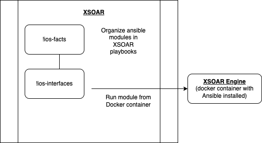
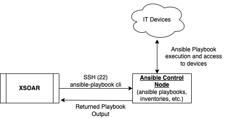
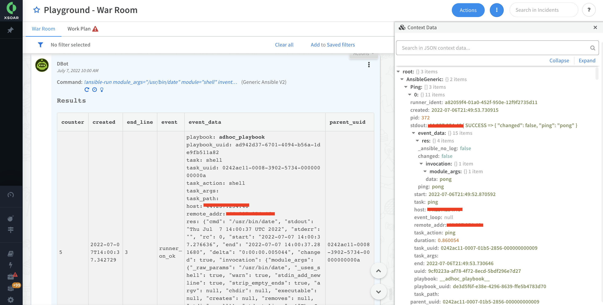

# Ansible and XSOAR
With many IT teams currently using Ansible to manage there deployments,
a natural question has been, "how can XSOAR work with Ansible"?

As XSOAR provides a standardized interface for developing automations and playbooks across
a wide variety of use cases, it can be useful to understand how other automation technologies can
compliment an XSOAR deployment.

## XSOAR Integrations for Ansible
There are a wide variety of Ansible integrations available in the XSOAR marketplace today.
These integrations are focused on making it easy to run comman Ansible modules from within an 
XSOAR playbook.
These commands leverage the Ansible Runner python package under the hood and can provide a lot of 
convience to the end user as the Ansible deployment itself is handled by XSOAR.
XSOAR spins up a Docker container with Ansible already installed and can execute any available Python command.
In most cases this is `ansible_runner.run()` which is documented [here](https://ansible-runner.readthedocs.io/en/stable/ansible_runner/#ansible_runner.interface.run).



These Ansible integrations are enabled and run in the same way as any other integration within XSOAR!

This allows for

* Multiple modules supported, easily extensible
* Commands predefined within XSOAR
* Manage all playbooks through XSOAR

Download packs from the XSOAR Marketplace to get started.

## Remote SSH from XSOAR to Ansible Host
As you might already have Ansible playbooks and infrastructure deployed within your environment you can also leverage the SSH integration within XSOAR
to connect to the Ansible host, execute the playbook and pull back the results.



You can capture the JSON output from the Ansible playbook which is triggered as a part of a larger XSOAR workflow similar to 

```
!ssh cmd=`ANSIBLE_STDOUT_CALLBACK=json ansible-playbook -i /home/ec2-user/inventory.ini /home/ec2-user/ping.yml` extend-context=AnsibleOutput=.=JSON.parse(val.output)
```

With this method you can leverage what you already have deployed today from an Ansible perspective and integrate it directly into your new XSOAR playbooks!

## Run Generic Ansible Commands from XSOAR

It might also be advantageous to make  XSOAR the control node and run generic Ansible modules in a free form fashion.
There is an Alpha integration attached to this repo for a Generic Ansible Integration.  
If no native integration exists within XSOAR today, this may be a reasonable alternative as it provides high amounts of flexability.

It is essentially a light wrapper around `ansible_runner.run()` which allows for you to run any module included in standard Ansible installation.

You can create an `inventory` list within XSOAR for managing hosts or provide there IP directly to the single `!ansible-run` command.

Two examples of running the command are

```
!ansible-run module=ping inventory=${lists.inventory}
!ansible-run host="44.237.254.46" module_args=`/usr/bin/date` module=shell
```

You can create the `inventory` list in XSOAR with contents such as 

```
[xsoar:vars]
ansible_python_interpreter=/usr/bin/python3

[xsoar]
192.168.1.1 ansible_network_os=centos ansible_user=centos
```

So it is easy to manage and target the hosts you want to execute against. Note the lists content is accessed with DT as `${lists.<listName>}` in XSOAR.
This generic integration might also be extended in the future to natively run Ansible playbooks directly from within XSOAR leveraging similar ansible runner commands.

Note this integration is still in Alpha and hasn't been extensively tested so it is not ready for production. Feel free to use and modify it as needed until release.


