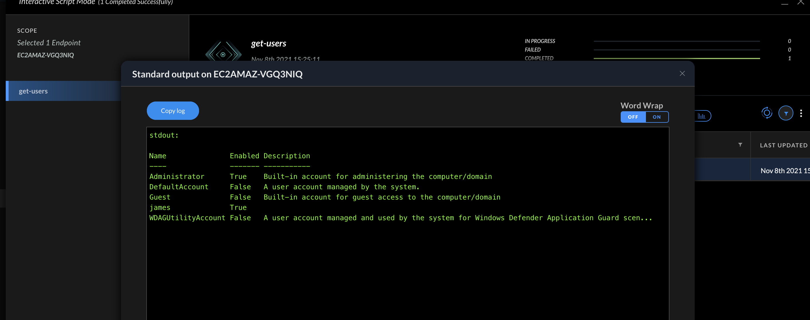
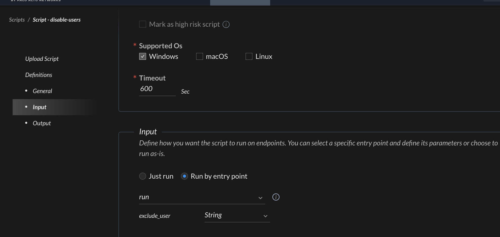
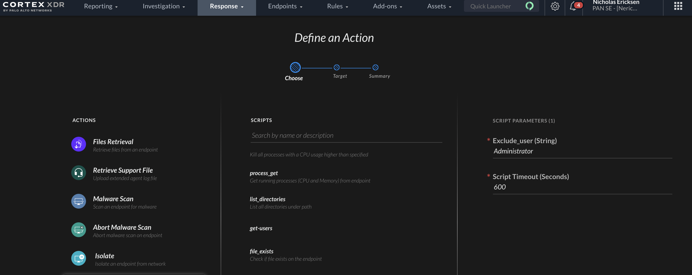
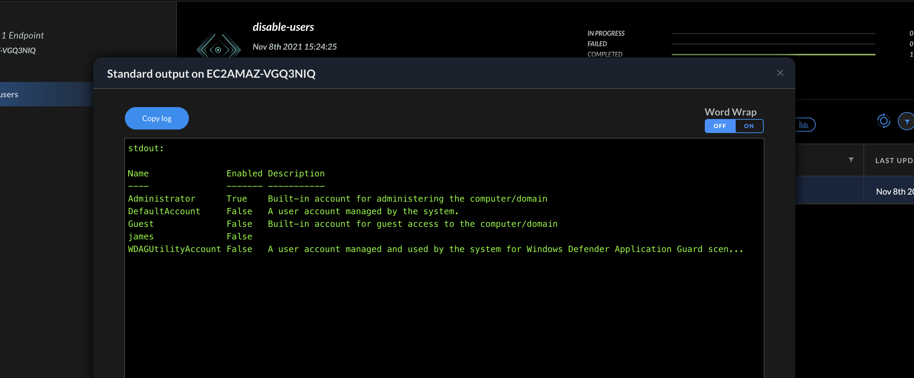

# Powershell Scripts Run From XDR

XDR has a powerful ability to run Python scripts on an endpoint.
Many users from the Windows perspective use Powershell today.

By creating a Python wrapper around these Powershell scripts it is 
possible to leverage existing Powershell scripts with XDR.

Attached in this repo is the `ps-template.py` script which can be used as a generic starting point
for porting over the Powershell script.


## Leveraging the Python Wrapper
The Powershell script is wrapped in a Python string.

A temporary PS file is then written to the endpoints disk and run before being deleted.
It would also be possible to run this as base64 encoded commands presumably in order to 
remove the need to write to disk.
Writing the file to disk is the simpliest and most maintainable method for wrapping the PS script.


## Simple Powershell Example: Get Local Users

Let's say you have a Powershell script to get all the local users and there state on the machine.
This could be a simple one line PS1 file such as

```
Get-LocalUser
```

which outputs somthing like

```
PS C:\Users\Administrator> Get-LocalUser

Name               Enabled Description
----               ------- -----------
Administrator      True    Built-in account for administering the computer/domain
DefaultAccount     True    A user account managed by the system.
Guest              False   Built-in account for guest access to the computer/domain
james              True
WDAGUtilityAccount False   A user account managed and used by the system for Windows Defender Application Guard scen.
```

The `ps-template.py` can be used as a starting point for wrapping an existing PS script.
```
import subprocess
import sys
import os

def run():

  ps = """
  """

  # Write the PS script to a local tmp file
  with open("C:\\Users\\Public\\tmp.ps1", "w") as f:
    f.write(ps)

  # Execute the tmp PS script
  result = {}
  try:
    with subprocess.Popen(["powershell.exe", "C:\\Users\\Public\\tmp.ps1"], stdout=subprocess.PIPE, stderr=subprocess.PIPE, shell=True) as p:
      stdout, stderr = p.communicate()
      if stderr:
        sys.stderr.write(f"stderr: \n{stderr.decode('utf-8')}\n")
      if stdout:
        sys.stdout.write(f"stdout: \n{stdout.decode('utf-8')}\n")
        result["PSScript"] = stdout.decode('utf-8').splitlines() 
      else:
        result["PSScript"] = None 
    
  except Exception as e:
    sys.stderr.write(f"Failed: {e} ")
  
  # Remove the tmp PS file
  os.remove("C:\\Users\\Public\\tmp.ps1")
  return result
```


In this template a single Python function exists which will be specified as the entry point of the XDR action script.
It is possible to test this script locally on a Windows machine with Python installed before uploading as well.
This is recommended to test for any errors when porting the PS script over.
Simply call the `run()` function at the end of the Python script.


The contents of the Powershell file should be copied and put into the Python string `ps`.

```
  ps = """
  Get-LocalUser
  """
```

The file can then be uploaded into XDR >> Response >> Action Center under "Available Scripts Library" by selecting "New Script".
The complete example is provided in `get-users.py` in this repo.



## Advanced Example: Disabling Users and Passing Script Arguments
Attached to this repo is `disable-users.py` script. It can be uploaded into 
XDR and run on a specified endpoint.
The goal of the script is to disable all local accounts on the Windows machine
except for a specified user.

A user to exclude from the disabling is passed as an argument.

The entry point should be specified as the `run` function when the script
is uploaded to XDR.


The arguments passed to the `run` function in the Python function can then be passed via the XDR console.



Arguments can be passed to the PS script using `%s` string formatting syntax in Python.
```
import subprocess, sys
import os

def run(exclude_user):

  ps = """
  $excludeUser = "%s"

  $allUsers = Get-LocalUser

  foreach ($user in $allUsers.Name) {
    if($user -ne $excludeUser) {
      Get-LocalUser $user | Disable-LocalUser
    }
  }
  Get-LocalUser
  """ % exclude_user
.
.
.
```

These arguments are passed to the Python run function and then utilized in order of there appearence in the `ps` string. Multiple arguments are seperated with a `,`.


