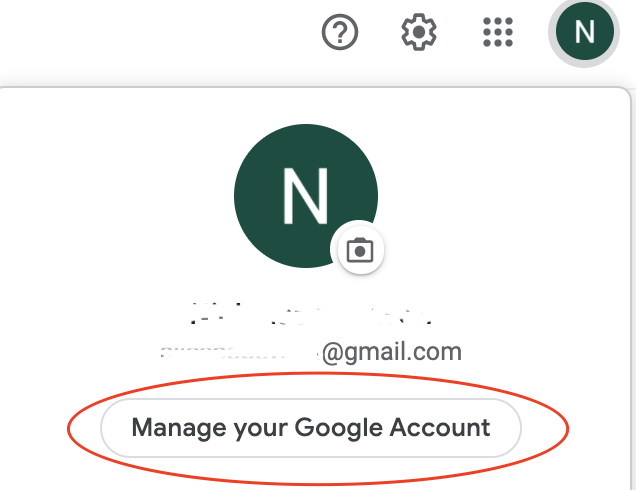
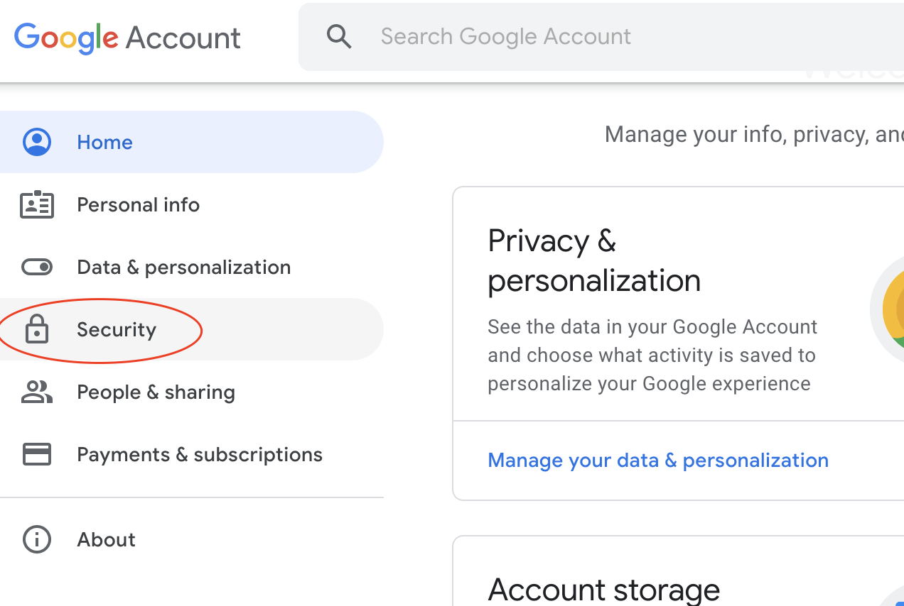

# Mail Listener Integration with Gmail
You can use a gmail account to test the XSOAR mail listener and run phishing excursuses.
You will need to set insecure apps in the gmail account.  





The integration settings are then as follows


## GMAIL Listener
```
Mail server hostname: imap.gmail.com
IMAP Port: 993

Use TLS for connection
Don't verify certificate
```

## GMAIL Sender
```
Hostname: smtp.gmail.com
Port: 587

Don't verify certificate
STARTTLS for connection type
```

