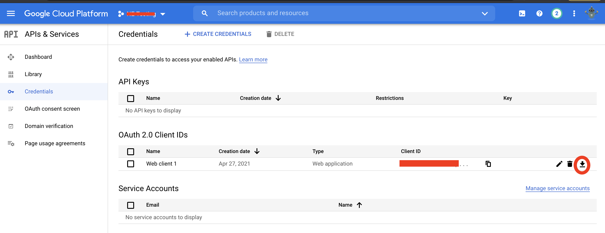

# Google Drive Single User Setup

The Google Drive Single User integration is designed to allow access to the Google Drive APIs using 
OAuth to authenticate. This is different than the existing integration which is currently designed to 
support a service account with domain wide delegation.

### Google Drive OAuth Setup
In this example setup `https://localhost` is used in the redirect url.
The scopes used in this example are 

```
https://www.googleapis.com/auth/drive
https://www.googleapis.com/auth/drive.file
https://www.googleapis.com/auth/drive.metadata
```

1. Go to https://console.developers.google.com.
2. Create a new project
3. Enable the Google Drive API (under API & Services >> Library)
4. Configure the OAuth consent screen and add the required scopes.
  * User Type: Internal
  * Scopes: same as above
5. Create an OAuth 2.0 Client ID (under Credentials)
  * Application Type: Web Application
  * Authorized Redirect URI: https://localhost
6. Download the OAuth client configuration file



Useful Reference: [https://xsoar.pan.dev/docs/reference/integrations/google-drive#configure-service-account-for-google-drive]

### Create Custom Docker Image

From the XSOAR CLI run
```
/docker_image_create name=googleoauth base=`demisto/googleapi-python3:1.0.0.13812` dependencies=google-auth,google-auth-oauthlib,google-auth-httplib2,google-api-python-client
```

And confirm the image creation with
```
/docker_images
```


### XSOAR Integration Setup
1. Create a new instance of of the GoogleDrive (single user) integration
2. Add the contents of the OAuth client configuration file downloaded previously to the `User's OAuth JSON` parameter.
3. Enter `OAuth Redirect URI` (should be `https://localhost` for this example)
4. Enter a unique `State Passthrough Value` parameter. This is used when generating the authorization code.


#### Create the Authorization Code
Create the OAuth consent url of the following form

```
https://accounts.google.com/o/oauth2/v2/auth?
 scope=https%3A//www.googleapis.com/auth/drive.metadata+https://www.googleapis.com/auth/drive+https://www.googleapis.com/auth/drive.file&
 access_type=offline&
 include_granted_scopes=true&
 response_type=code&
 state=<State_Passthrough_Value>&
 redirect_uri=https%3A//localhost&
 client_id=<client_oauth_id>
```

Place this url into a web browser and consent to the reqeusted permissions by signing in as an appropriate user.
You will then be redirected back to `https://localhost` and the authorization code will be in the query parameters.

Example
```
https://localhost/?state=state_parameter_passthrough_value&code=AAAAAAAABBBBBBBBBCCCCCC_CCCCDDDDDDDD_FFFFFFF&scope=https://www.googleapis.com/auth/drive.metadata%20https://www.googleapis.com/auth/drive%20https://www.googleapis.com/auth/drive.file
```
Enter the `code` parameter which is returned into the `Authorization Code` parameter of the XSOAR integration.
In this example it would be `AAAAAAAABBBBBBBBBCCCCCC_CCCCDDDDDDDD_FFFFFFF`.

Additional documentation: [https://developers.google.com/identity/protocols/oauth2/web-server#httprest_1](https://developers.google.com/identity/protocols/oauth2/web-server#httprest_1)

### Testing the Integration
Select done on the integration instance within XSOAR.  You can then test the authentication was setup correctly with `!google-drive-test-auth`.
If this is successful you can then run additional commands!

### Troubleshooting

If you see below it is probably because too many auth codes were generated for this token.  You can possibly remove them in the UI or delete and recreate the OAuth client credential. You should also make sure the authorization code has not expired and has the required scopes.

```
   File "/usr/local/lib/python3.8/site-packages/oauthlib/oauth2/rfc6749/errors.py", line 405, in raise_from_error
    raise cls(**kwargs)
 oauthlib.oauth2.rfc6749.errors.InvalidGrantError: (invalid_grant) Malformed auth code.
```
