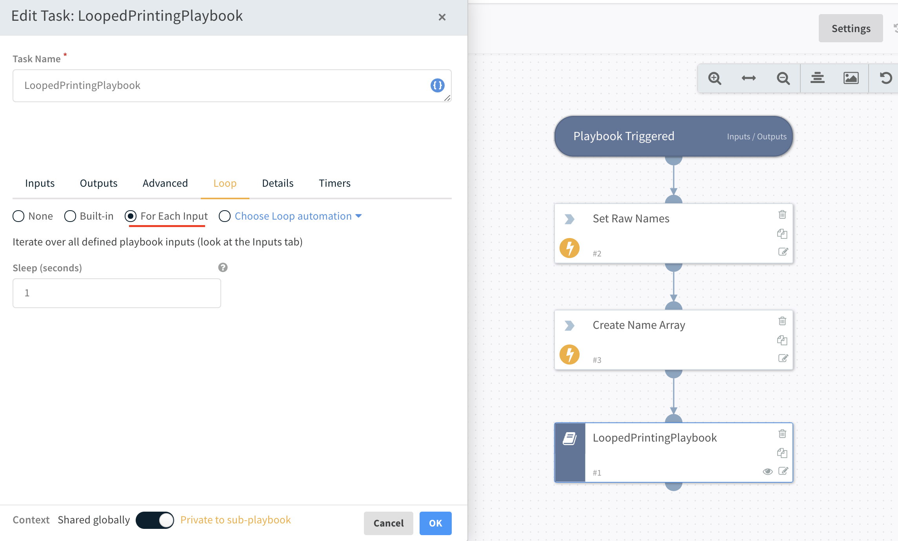

# Looping Playbooks
Playbooks can be nested within other playbooks and are called sub-playbooks.
Subplaybooks are useful for creating modular and resuable workflows.
They can also be used for looping through a set of inputs.
An overview of subplaybook loops can be found [here](https://docs.paloaltonetworks.com/cortex/cortex-xsoar/6-0/cortex-xsoar-admin/playbooks/configure-a-sub-playbook-loop)

### Setting Up a Looping Sub-Playbook
In this example a playbook is created to demonstrate the basics of creating a playbook which can then be used to loop through an array of items and perform some action.
Specifcally an array of names is used as input to the subplaybook which prints out a greeting using each name.

First the an array of names is created by splitting a string of comma seperated names into an array.
The array of names is then used as an input into the subplaybook.

The subplaybook is looped through for each name in the list a greeting is printed out in the "LoopedPrintingPlaybook".
The "For Each" setting must be checked in the Looping section of the subplaybook automation block of the main playbook.

The inputs for the subplaybook are defined when it is created. 
Playbook inputs are documented [here](https://docs.paloaltonetworks.com/cortex/cortex-xsoar/6-0/cortex-xsoar-admin/playbooks/playbook-inputs-and-outputs)

Here an input is defined called `name` for the subplaybook.

Automation steps can utilize the inputs by `${inputs.name}`.

### Example
Within this repo are two test playbooks to try out looping. 
You should first upload the "LoopedPrintingPlaybook" into your XSOAR instance as it is a dependency of the main playbook.
Then you can load the "LoopingExample" playbook onto the instance.

Create a new incident with the playbook attached, or attach the playbook into a Playground to run it and see the greeting output in the warroom.

