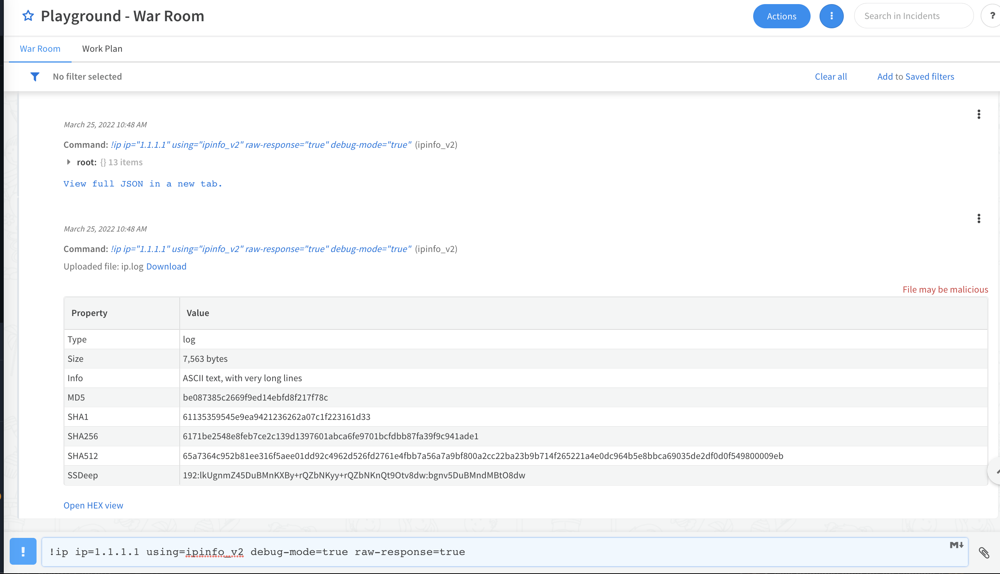
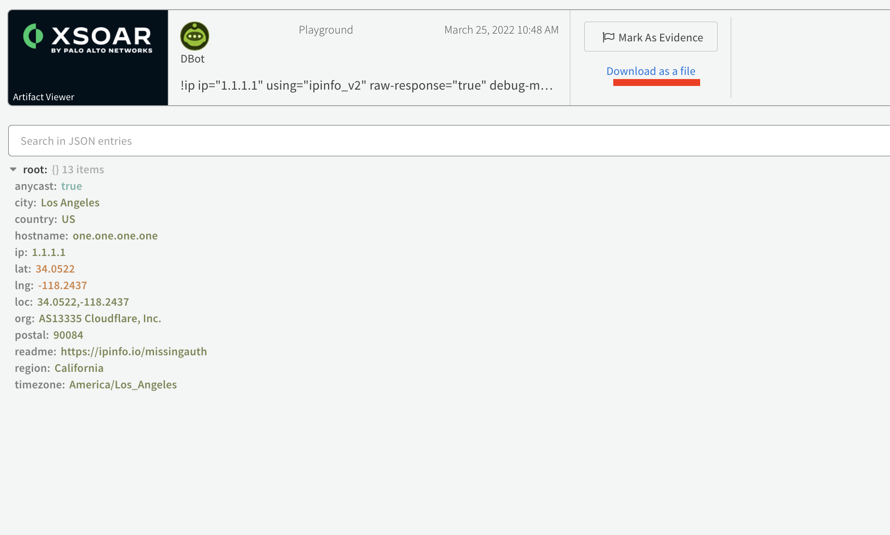
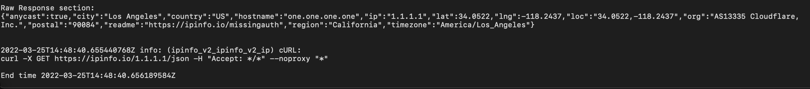
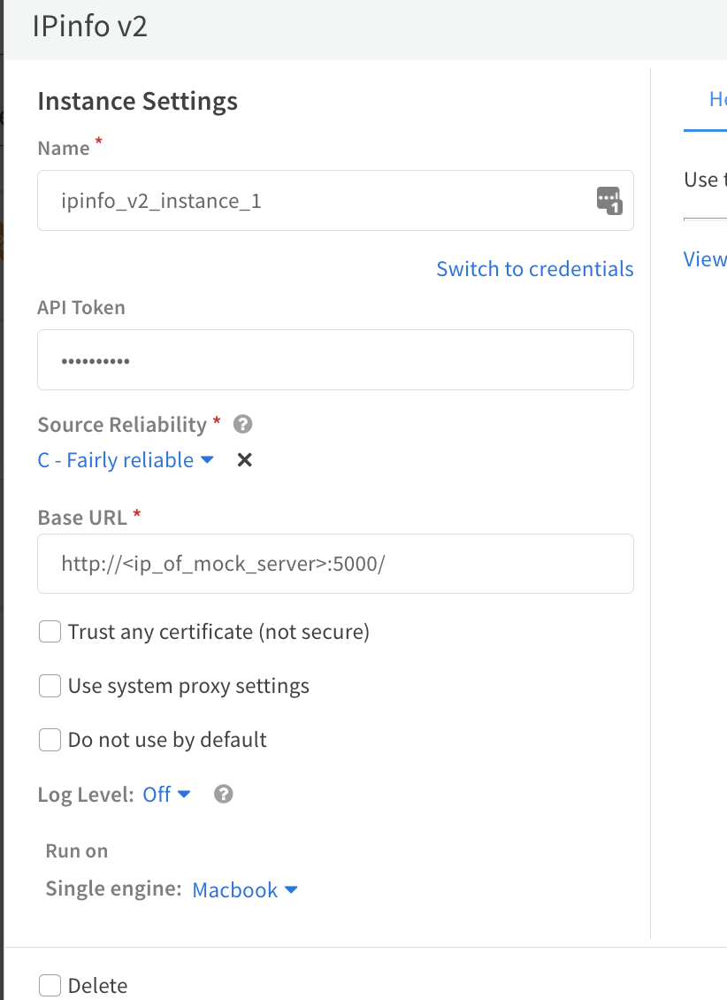

# Mocking an XSOAR Integration
It may be useful during the integration testing stage to have mock API endpoints
which can simulate the responses from your production tools.

This can be achieved by "mocking" the APIs and returning static JSON responses in the same form
as the actual APIs.
In Python this can be achieved using a library called Flask.

## Pre-requisites
* XSOAR installation up and running
* Another machine running Python3 with Flask installed

You should consider using `venv` to create the application.
From inside the application directory simply run


```
python3 -m venv venv
pip install flask
```

## Example: IPInfo
The IPInfo integration will be used in this example and a mock endpoint with be created to simulate
running the !ip command against this 3rd party tool.

The api call returned from this instance can be inspected by running

```
!ip ip=1.1.1.1 using=ipinfo_v2 debug-mode=true raw-response=true
```

This returns the raw JSON from the API call as well as a debug file with an example Curl request.



If you open the raw response in a new tab you can download the JSON produced by the IP Info API.




This information is also available in the debug log in addition to a Curl suggestion



Note the endpoint of the API call, method used, and copy the JSON data.

### Mock with Flask
The flask app can then be created in the following format

```
import flask
from flask import request, jsonify 

app = flask.Flask(__name__)
app.config["DEBUG"] = True


@app.route('/<ip>/json', methods=['GET'])
def api_all(ip):
    ip_info = {
        "anycast": True,
        "city": "Los Angeles",
        "country": "US",
        "hostname": "one.one.one.one",
        "ip": ip,
        "lat": 34.0522,
        "lng": -118.2437,
        "loc": "34.0522,-118.2437",
        "org": "AS13335 Cloudflare, Inc.",
        "postal": "90084",
        "readme": "https://ipinfo.io/missingauth",
        "region": "California",
        "timezone": "America/Los_Angeles"
    }
    return jsonify(ip_info)


app.run(host="0.0.0.0")
```

and should be saved to a file called `mock.py`.

Here it is shown that the flask library is imported and the the JSON is hardcoded in the `ip_info` variable.
One endpoint is defined using a `GET` request and an `<ip>` passed as a URI parameter.

The `jsonify` of the data is returned to the end user.
Finally the app is set to listen on all network IPs.

The app can be run with `python3 mock.py`

The following curl command can be run on the mock server to confirm operation

```
curl http://<ip_of_mock_server>:5000/1.1.1.1/json
```

An engine can then be deployed if needed to connect from XSOAR to this server or it can be configured to directly connect if possible.

The integration in XSOAR can then be configured as such

The test button should work and you are now mocking up data!




### Caveats
* Note this will always return the same data for each IP. You can randomize it if needed.
* You may have to inspect the code when implmenting certain endpoints (ie test)
* Not all integrations will return curl examples in the debug log
