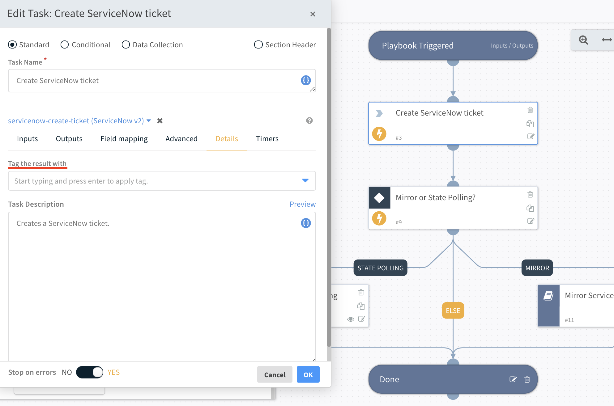
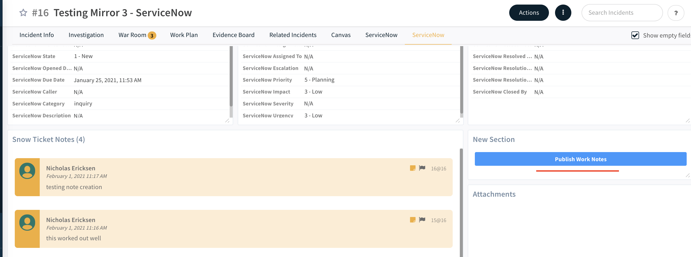

# Publish Work Notes to Service Now

Incident mirroring is a new feature that has been available in XSOAR since version 6.0.
Mirroring allows for specified incident fields to be synced between XSOAR and external ticketing systems such as ServiceNow.
The specific fields which are mirrored are handled by the incoming and outgoing incident mappers. 
This is documented [here](https://xsoar.pan.dev/docs/reference/integrations/service-now-v2#configure-incident-mirroring) for SNOW and in general [here](https://docs.paloaltonetworks.com/cortex/cortex-xsoar/6-0/cortex-xsoar-admin/incidents/classification-and-mapping/configure-incident-mirroring) for XSOAR.

Warroom entries can also be mirrored as work notes in SNOW by adding a specfic tag to the entry.
For playbook tasks this can be defined within the playbook task editor.





This is sufficent for most use cases, but at times it is useful for the analyst to manually add notes during the course of an investigation.
The "Service Now Ticket" layout provided by the OOTB Service Now content pack in the XSOAR marketplace provides analysts with a quick way to create a note directly from a layout.
In order for this note to be synced, a tag has to be added to the new entry.
As it requires switching between tabs in order to apply this tag, it present inefficiences to the analyst process.

### !PublishNotesToServiceNow
Buttons can be added to layouts to perform certain actions that can be customized by use of automation scripts.
The PublishNotesToServiceNow automation queries all notes without the "comment" tag for an existing incident and applies it if it doesn't exist.

```
entries = demisto.executeCommand("getEntries", {"filter": {"categories": ["notes"]}})

note_ids = []

for entry in entries:
    tags = entry["Tags"]
    if tags is None or "comments" not in tags:
        note_ids.append(entry["ID"])

demisto.executeCommand("setEntriesTags", {"entryIDs":note_ids,"entryTags":"comments"})
demisto.results(note_ids)
if len(note_ids) > 0:
    demisto.results(f"Set Comments Tag for {note_ids}")
else:
    demisto.results("No new notes to publish")
```

This scipt can be added as a button to the layout or run as the last step before incident close within the playbook.
Buttons and layouts are discussed further [here](https://docs.paloaltonetworks.com/cortex/cortex-xsoar/6-0/cortex-xsoar-admin/manage-indicators/understand-indicators/customize-indicator-view-layouts/customize-an-indicator-type-layout)

The complete `PublishNotesToServiceNow` is attached as a yaml file.



