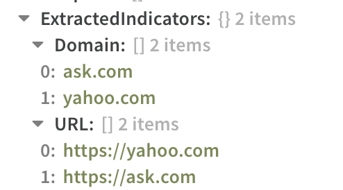
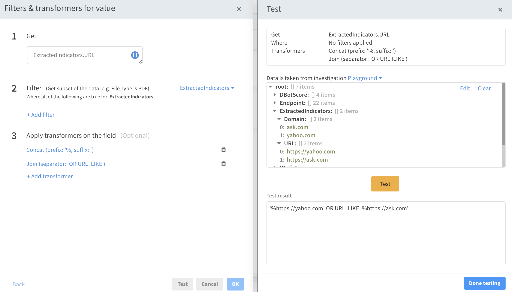

# QRadar Queries with XSOAR Transformers
It is often useful when building queries for systems that require joing multiple elements in the same query, such as URLs, to use XSOAR transformers.
XSOAR transformers are small helper scripts that can modify context upon input to automation tasks within playbooks.
Transformers are officially documented [here](https://docs.paloaltonetworks.com/cortex/cortex-xsoar/6-0/cortex-xsoar-admin/playbooks/filters-and-transformers.html)

### Example
If there are a list of URLs in context it is often desirable to format this array of elements into a single query such as 

```
SELECT "username", "Full URL", "sourceip" FROM events WHERE (URL ILIKE '%https://yahoo.com%' OR URL ILIKE ‘%https://ask.com’ OR URL ILIKE ‘%https://google.com’ ) LAST 24 HOURS.
```

As the first portion of this query is fixed it is important to observe the variable portion of the query string which is 

`'%<URL_1>' OR URL ILIKE '%<URL_2>'`

This variable piece will be created using transformers on the array of URLs existing in context as input to the `!Set` command.



A combination of the `concat` and `join` transformers can be used to get the job done.



This new key set to context can then be used as an input into the QRadar query automation.


```
!qradar-searches query_expression=`SELECT "username", "Full URL", "sourceip" FROM events WHERE (URL ILIKE ${NEW_URL_KEY}) LAST 24 HOURS.`
```
