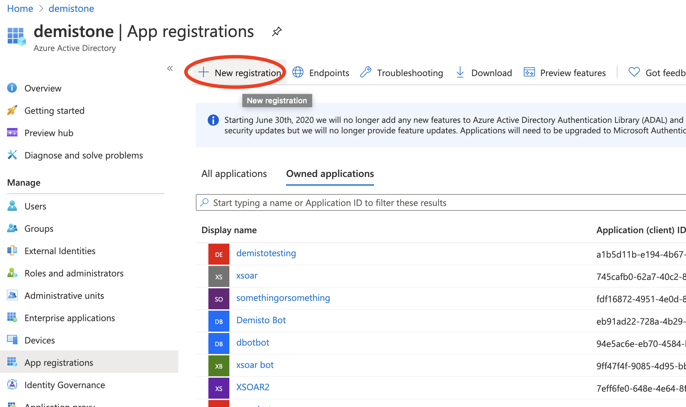
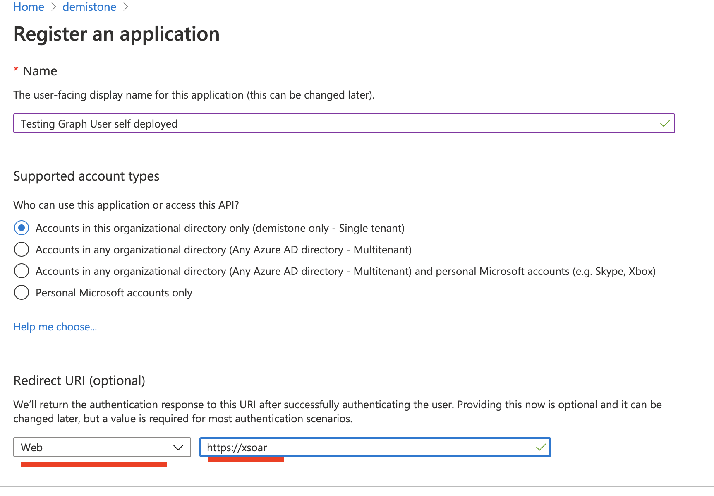
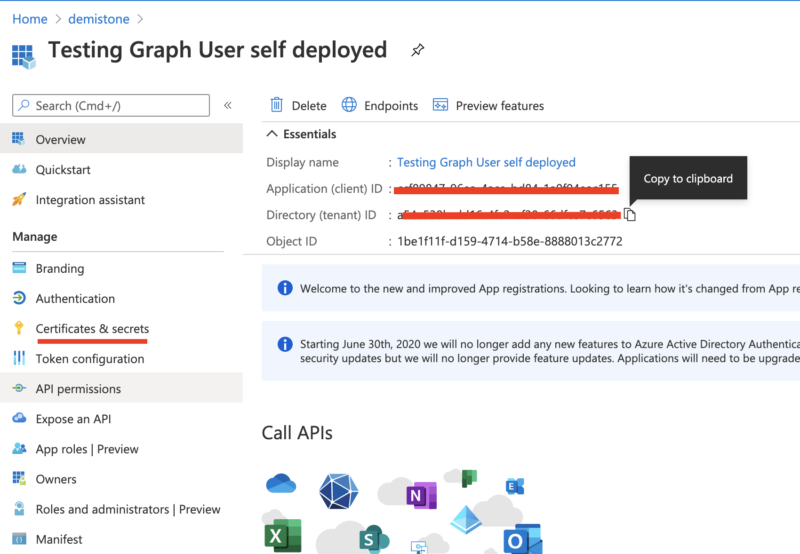
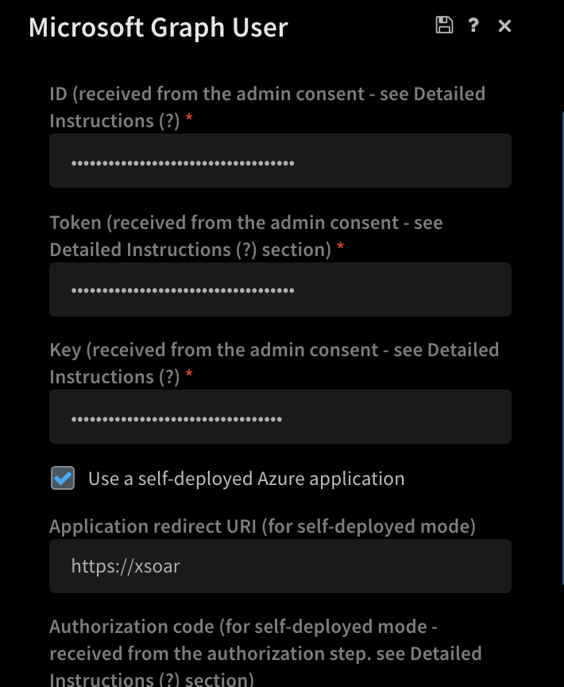
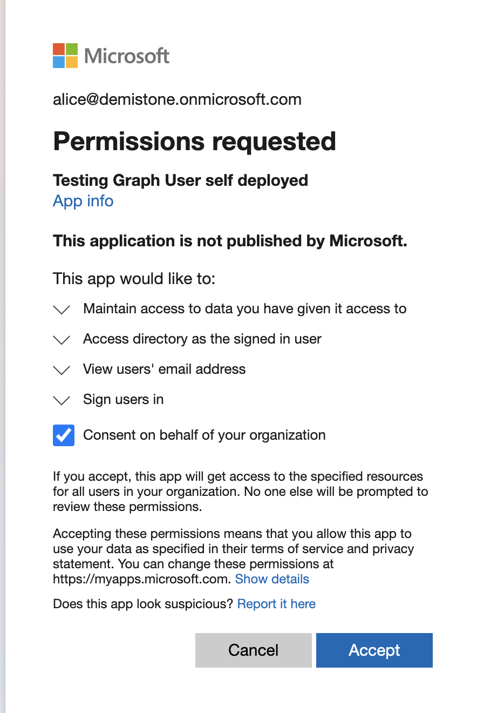
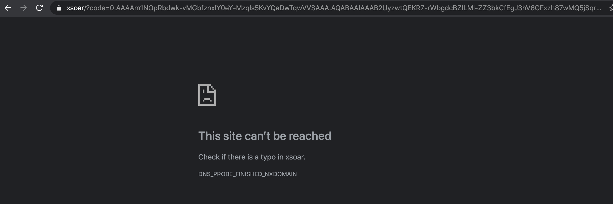
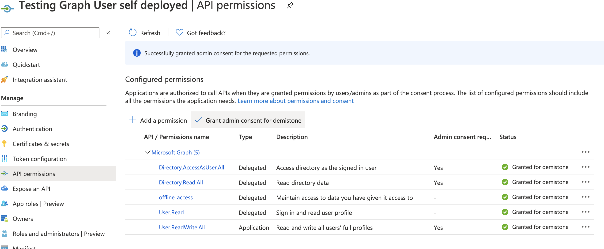

# Self Deployed Azure Apps and XSOAR

A detailed guide to self deployed apps in Azure since they are becoming more popular.

Here is our main documentation around setting up MS Graph User integration: https://xsoar.pan.dev/docs/reference/integrations/microsoft-graph-user

For self deployed applications it is also useful to look at this: https://xsoar.pan.dev/docs/reference/articles/microsoft-integrations---authentication

Here is a detailed step by step breakdown a well for your reference.  This is specifically for MS Graph User integration, but the process is similar for others.

1. Create a new App Registration in Azure

2. When you create the new registration you can input an arbitrary name and redirect uri of type web. In this example https://xsoar is used, you can use the same.

3. The following parameters are then needed to configure the XSOAR MS Graph User integration
* Azure Name -> XSOAR integration
* Application (client) ID -> ID
* Directory (tenant) ID -> Token
* Certificate and Secret -> Key

You can get these parameters from azure here

4. Check the "Use a self-deployed Azure application" checkbox on xsoar integration.  You should now have ID, Token, Key, And redirect uri also filled in.

5. You then need to generate the Authorization Code.  This is done by crafting a user authorization link documented here: https://xsoar.pan.dev/docs/reference/articles/microsoft-integrations---authentication

If you have used the same redirect I mentioned above you can use the following link, just replace with your apps tenant and client id

https://login.microsoftonline.com/TENANT_ID/oauth2/v2.0/authorize?response_type=code&scope=offline_access%20directory.accessasuser.all&client_id=CLIENT_ID&redirect_uri=https%3A%2F%2Fxsoar

This will prompt for the admin user to sign in and grant the app the appropriate permissions

Once that is complete you will be redirected to the redirect URI and will receive an authorization code in the query parameters of the uri.  This value should be used in the xsoar integration under Authorization Code.  Note there are multiple query parameters returned you should just copy the code value

6. Save the integration settings and Test successful setup by running the !msgraph-user-test command from the xsoar cli.

You should confirm the required permissions are assigned to the app in azure and admin consent is granted on them to ensure all integration commands will run as expected

* Directory.Read.All - Delegated
* User.ReadWrite.All - Application
* User.Read - Delegated

