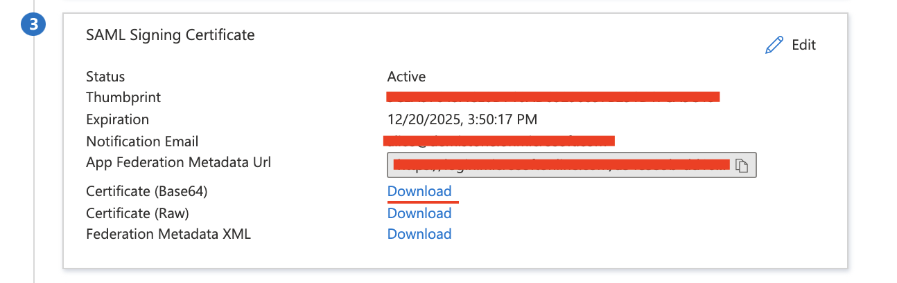

# Single Logout with Azure AD as IDP

The SAML 2.0 integration allows for connecting XSOAR to IDPs for authentication and RBAC purposes.

Documentation for setting up SAML SSO with various IDPs can be found [here](https://docs.paloaltonetworks.com/cortex/cortex-xsoar/6-0/cortex-xsoar-admin/users-and-roles/authenticate-users-with-saml-20.html)

This guide intends to enhance the Azure AD portion around Single Logout.
A prerequisite is setting up SSO and confirming it is operational as described in the link above.

In order for SLO to function It is required to select the "Sign request and verify response signature" on the SAML 2.0 integration in XSOAR.
This requires that the IDP (Azure AD) public key be entered into the "IdP public certificate" XSOAR integration parameter and can be retrieved from the Azure AD here



The "IdP private key (pem format)" can be generated according to our docs for ADFS SLO
https://docs.paloaltonetworks.com/cortex/cortex-xsoar/6-0/cortex-xsoar-admin/users-and-roles/authenticate-users-with-saml-20/set-up-adfs-as-the-identity-provider-using-saml-20/set-up-saml-logout.html

It should be possible to use any unencrypted private key here.
Note this is technically the SP private key.

When creating the non Gallery Application in Azure AD the SAML token is set to only "Sign SAML Assertion" by default.

This needs to be updated to be "Sign SAML Response and Assertion" on the Azure AD side.


This is based on the SAML 2.0 integration parameters available on XSOAR server v6.0.

In v6.1 you can chose to selectively sign the response, assertion or both in the SAML 2.0 integration and this should match the setting in Azure AD.


The "IdP Single Logout URL" parameter on the SAML 2.0 XSOAR integration can then be grabbed from


And the "Single Logout Service Endpoint" SAML 2.0 integration parameter derived in the following way,

```
https://<demisto-url>/saml-logout
```

There is no need to check the following parameter or specify nameID format


SLO should then function as expected.

### References
* https://live.paloaltonetworks.com/t5/cortex-xsoar-articles/cortex-xsoar-how-to-setup-saml-authentication/ta-p/387444
* https://docs.paloaltonetworks.com/cortex/cortex-xsoar/6-0/cortex-xsoar-admin/users-and-roles/authenticate-users-with-saml-20/microsoft-azure-as-the-identity-provider-using-saml-20.html
