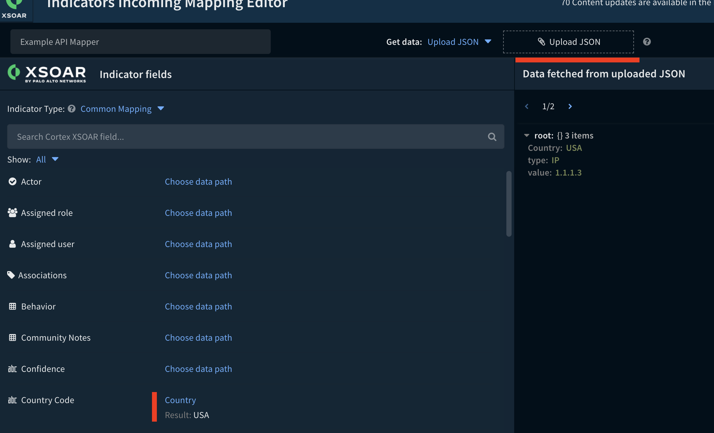
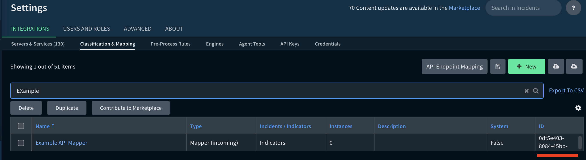

# Bulk Upload of Indicators using XSOAR API

It is possible to upload an array of JSON indicators via the API using the `/indicators/feed/json` endpoint.

For the `/indicators/feed/json` endpoint either a classifier or "type" needs to be sent with each indicator object.  If data is in a different format than the XSOAR indicator objects a mapper will be required.

Example without mapper or classifier

```
curl --location --request POST 'https://<xsoar>/indicators/feed/json' --header 'Content-Type: application/json' --header 'Authorization: <api_key>' --data-binary '{
  "bypassExclusionList" : true,
  "indicators" : [{
    "value": "1.1.1.3",
    "type": "IP"
  },
  {
    "value": "1.0.0.3",
    "type": "IP"

  }]
}' --insecure -vv
```

If there is more arbitrary data to be mapped in the json then you should save example data as json file and upload into the XSOAR UI to perform the mapping



The mapper id can be viewed by adding ID to the mapping column



It is then possible to post the JSON leveraging the mapper with 

```
curl --location --request POST 'https://<xsoar-ip>/indicators/feed/json' --header 'Content-Type: application/json' --header 'Authorization: <API_KEY>' --data-binary '{
  "bypassExclusionList" : true,
  "mapperID": "0df5e403-8084-45bb-87e2-8fb36e1a2a91",
  "indicators" : [{
    "value": "1.1.1.3",
    "type": "IP",
    "Country": "USA" 
  },
  {
    "value": "1.0.0.3",
    "type": "IP",
    "Country": "EU" 

  }]
}' --insecure -vv
```

Mapper and example json provided in this repo.
