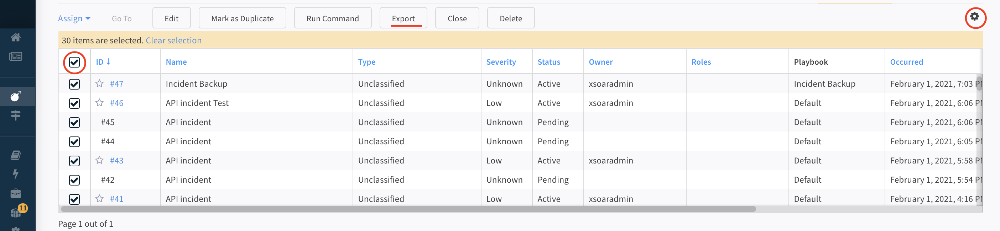

# Exporting Incident Data

XSOAR is an API driven tool. Almost all functionality within the tool can be controlled by API calls. Data is easily transferred between systems using JSON or CSV files which contain exports of XSOAR incidents and data.


### Export Data as a Job
It is possible to query incidents using 

```
!GetIncidentsByQuery query=`status:closed` fromDate=`7 days ago` outputFormat=json
```

This returns a file of the incident JSON which can easily be emailed using the `!send-mail` automation. 
As the query results file can also be read by XSOAR and sent to other data stores which accept JSON.

A playbook can be created which can perform these operations and which can be configured as an XSOAR Job to run on a reoccurring basis.

### Batch Export Incidents (UI)
You can also manually go into the UI and export incidents into a CSV file directly in the incidents tab.
The columns to export can be configured by selecting from the various incident fields




### Batch Export Incidents (API)
Set the following bash variables,

```
SERVER_IP=<SERVER_IP>
API_KEY=<XSOAR_API_KEY>
```

#### Create CSV File
The `/incident/batch/exportToCsv` API endpoint can be used to create a CSV export of incidents with the given parameters.

Common parameters to consider are the incident query, date range, and columns.  Example of downloading all incidents for given data range is below.


```
curl --insecure -X POST "https://${SERVER_IP}:443/incident/batch/exportToCsv" -H 'content-type: application/json' -H 'accept: application/json' -H "Authorization: ${API_KEY}" --data-binary '{"all":true,"filter":{"page":0,"size":50,"query":"-status:closed -category:job","sort":[{"field":"id","asc":false}],"period":{"by":"day","fromValue":7}},"columns":["id","name","type","severity","status","owner","roles","playbookId","occurred","dueDate"]}' --compressed
```

Which returns a file name such as "incidents_report_Tue_02_Feb_2021_14_47_08_UTC.csv"

This file name can then be used to request the created CSV file

#### Download Created CSV
```
curl --insecure -X GET "https://${SERVER_IP}:443/incident/csv/incidents_report_Tue_02_Feb_2021_14_47_08_UTC.csv" -H 'content-type: application/json' -H 'accept: application/json' -H "Authorization: ${API_KEY}" --compressed -o backup.csv
```

There is also a "Demisto REST API" integration which can facilitate demisto API calls and can be configured within the XSOAR UI.
These API calls can then be used within playbooks as a part of backup workflows.

