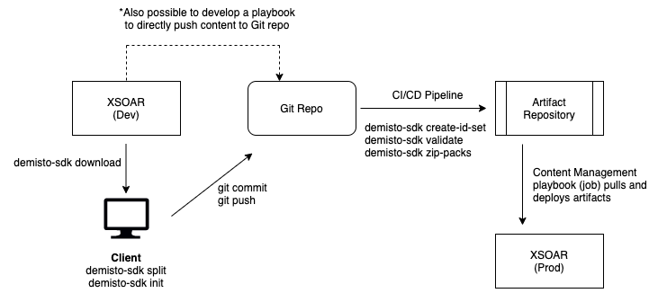

# XSOAR Software Development Lifecycle

Today there are three main methods for developing and deploying content with XSOAR.

1. Standalone Development
2. Remote Repository Feature
3. Content Management Pack (alpha)

### Standalone Development
In the simplest form XSOAR is a completely self contained system.
Content can be developed using the built in playbook editor and IDE.
The XSOAR instance in this scenario serves as the content repository.
Content is developed locally and stored locally.
System backups can be configured for on premises instances and content bundle downloads can be pulled via API periodically from hosted instances for redundancy.

Separate development and production environments can be deployed and content can be manually exported between them using the UI or demisto-sdk download and upload commands.

### Remote Repository Feature
The remote repository functionality built into XSOAR allows for syncing content between development and production machines using a Git repository.
An overview can be found [here](https://docs.paloaltonetworks.com/cortex/cortex-xsoar/6-2/cortex-xsoar-multi-tenant-guide/remote-repositories-for-multi-tenant-deployments/remote-repositories-overview).

When content is ready to be deployed from the development to production environment each item is selected in the "Remote Repository" tab as described in the documentation linked to above.
The content files are pushed in the unified yaml format.
This is the same format used when exporting and importing files directly from the UI.
The Git repository used can have a single branch or a pre release branch and release branch.
Code cannot be pushed directly to the Git repo from any other source or client other than the dev XSOAR instance!
These are important distinctions for a couple reasons.

Unified yaml files described [here](https://xsoar.pan.dev/docs/integrations/package-dir) and are single yaml files which contain the content metadata and in the case of integrations and automations, also contain the code as a string assigned to a yaml field.
This format has the benefit of being compact and self contained.

When content is pushed as unified yaml file from the dev instance to a single branch Git repo it becomes available to the production instance as a content update similar older versions of XSOAR.
A second branch can be introduced which allows for reviewing the pushed content and running a CI/CD pipeline on the unified files before merging into the main branch assigned to the production instance.
This methodology has a lot of advantages compared to manually moving content between instances as is the case in Standalone Development.
Content can be reviewed and verified before being pushed to production.
Git commits are used for each release and can therefore be audited.

### Content Management Pack
The requirement to leverage a CI/CD pipeline during the content release process can be further improved by leveraging standard coding tools and practices.
Unified yaml files can be split into corresponding code and yaml configuration files using the demisto-sdk.
The demisto-sdk split functionality is designed to handle this exact functionality.

Splitting content into separate files allows for creating more traditional Git repository structures and treating content as pure code.
Although more complex in design and implementation than the previous two methodologies there is an immense amount of flexibility possible with this methodologies.

The official demisto/content repository leverages this Pack Structure for its development.
The (Content Management Pack (alpha))[https://xsoar.pan.dev/docs/reference/packs/content-management] is designed to help XSOAR users leverage the same design principals as the official content repository.
This can be used as opposed to the Remote Repository functionality previously described.

In this scenario content from a development instance is pushed to a Git repo.
A CI/CD process is run to generate the required pack artifacts which are uploaded to an artifact repository.
These artifacts are deployed into XSOAR instances by running the `Configuration Setup` playbook.
This playbook can of course be scheduled as a job.
Details on configuration of the pack can be found in the documentation.

Content from the dev instance can be pushed to the Git repo in multiple ways.
A computer can be used to pull the content from a dev XSOAR instance using the `demisto-sdk download` command.
An end user can then create the pack structure before uploading to the git repository using their desired git client.

It is also possible to use a Git integration (such as GitHub or Gitlab) in XSOAR to push the appropriate files and pack structure.
This playbook would have to be created as it does not exist today.

